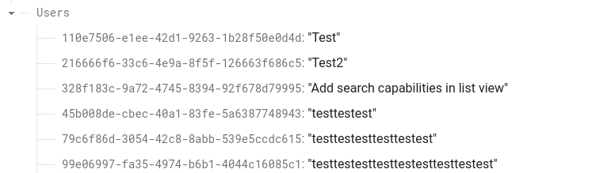

# Becafe

A small app integrating the Google Maps Platform in order to find cafes in set proximity.

 

## Features

**Proximity search**

Params: 250m, 500m, 700m, 900m

Determens the current location search radius.

 

**Rating and location details**

Green marked locations represent above average rating.

Yellow marked locations represent below average rating.

Average rating is the mean value of found cafe ratings.

Found cafe data is bound in a list view.

 

**Review support**

Each review is saved in the Firebase Realtime Database as a [{UUID} - {text}] value.

 

## Demo
{VIDEO}

 

## Tech

**Environment:** Android Studio

**Languages:** Kotlin

**Platforms:** [Google Maps Platform](https://mapsplatform.google.com), [Firebase](https://console.firebase.google.com/)

| Android Studio | Kotlin | Google Maps Platform | Firebase |
| ------ | ------ | ------ | ------ | 
|  |  |   |  |

 

## Authors

- [@v-gabriel](https://github.com/v-gabriel)

