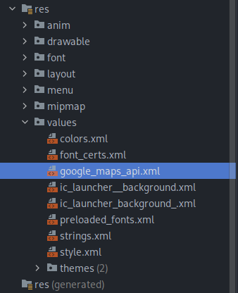
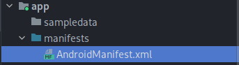
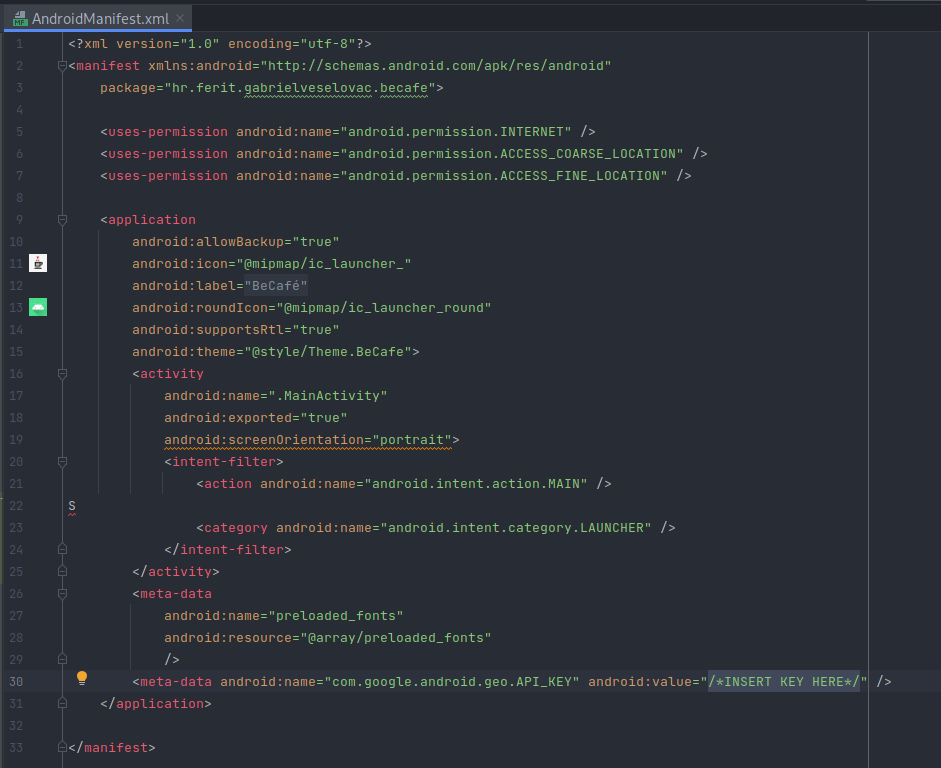

# Becafe

A small app integrating the Google Maps Platform in order to find cafes in set proximity.

 

## Features

**Proximity search**

Params: 250m, 500m, 700m, 900m

Determens the current location search radius.

 

**Rating and location details**

Green marked locations represent above average rating.

Yellow marked locations represent below average rating.

Average rating is the mean value of found cafe ratings.

Found cafe data is bound in a list view.

 

**Review support**

Each review is saved in the Firebase Realtime Database as a [{UUID} - {text}] value.

 

## Demo

**Setting up an API key**

For the app to function, a Google maps API key is required to be added ([click here to see how to manage API keys](https://developers.google.com/maps/documentation/javascript/get-api-key)).

Files in which to add the key:

*google_maps_api.xml*

*AndroidManifest.xml*

 

**Demo video**

https://user-images.githubusercontent.com/72694712/205411377-6b1998c0-fc19-4231-9486-11a3b34b0f04.mp4

 

## Tech

**Environment:** Android Studio

**Languages:** Kotlin

**Platforms:** [Google Maps Platform](https://mapsplatform.google.com), [Firebase](https://console.firebase.google.com/)

| Android Studio | Kotlin | Google Maps Platform | Firebase |
| ------ | ------ | ------ | ------ | 
| 

 | 

 |  

 | 

 |

 

## Authors

- [@v-gabriel](https://github.com/v-gabriel)

